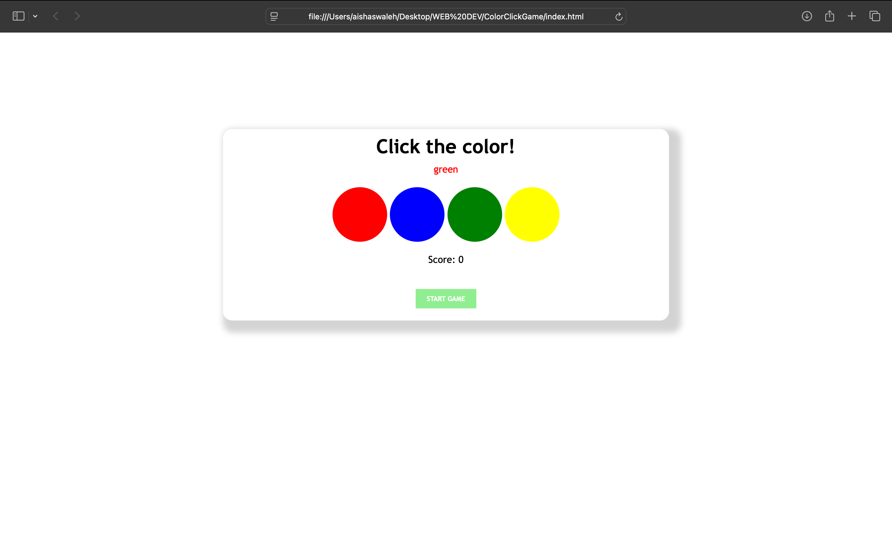

# Color Click Game

A simple browser-based color game built with HTML, CSS, and JavaScript.  
The player must click the button corresponding to the **color word**, not the font color.

## How to Play

1. Click **START GAME**.
2. A color word will appear above the round buttons.
3. Click the button that matches the word (ignore the font color!).
4. Score increases with each correct click.
5. If you click the wrong button, the game shows "Wrong!" and resets the score.

## Technologies

- HTML
- CSS
- JavaScript

## Screenshot

